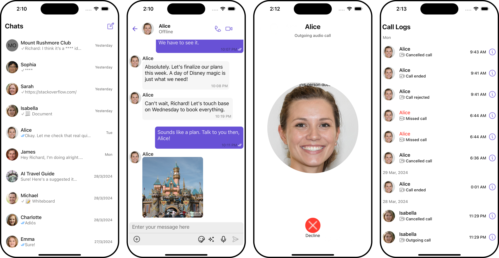

<p align="center">
  
</p>

# React Native Sample App by CometChat

This is a reference application showcasing the integration of [CometChat's React Native UI Kit](https://www.cometchat.com/docs/v4/react-native-uikit/overview) in React Native. It offers developers practical examples for incorporating real-time messaging, as well as voice and video calling functionalities, into their React Native-based applications.
<table>    
  <tr>
    <td valign="center" style="text-align: center">
      <div style="
          display: flex;
          align-items: center;
          justify-content: center;">
        
      </div>
      <div style="
          display: flex;
          align-items: center;
          justify-content: center;">
          React Native: iOS
      </div>
    </td>  
  </tr>
</table>
<hr />
<table>    
  <tr>
    <td valign="center" style="text-align: center">
      <div style="
          display: flex;
          align-items: center;
          justify-content: center;">
        
      </div>
      <div style="
          display: flex;
          align-items: center;
          justify-content: center;">
          React Native: Android
      </div>
    </td>  
  </tr>
</table>


## Prerequisites

- Ensure that you have the React Native development environment set up.
  - Follow instructions for your environment at https://reactnative.dev/docs/environment-setup

## Installation

1. Clone the repository:
   - Using HTTPS
     ```
     git clone 
     ```
   - Using SSH
     ```
     git clone
     ```
2. Navigate to the cloned directory:
   ```
   cd 
   ```
3. Install dependencies:
   ```
   npm install
   ```
4. For iOS, install dependencies after navigating to ios:
   ```sh
     cd ios
     pod install
   ```
5. Enter your CometChat _`App ID`_, _`Region`_, and _`Auth Key`_ in the [AppConstants.ts](https://github.com/cometchat/cometchat-sample-app-react-native/blob/v4/AppConstants.
6. Run the app on a device or emulator from the repo root.
   ```sh
   npm start
   npm run android
   npm run ios
   ```

